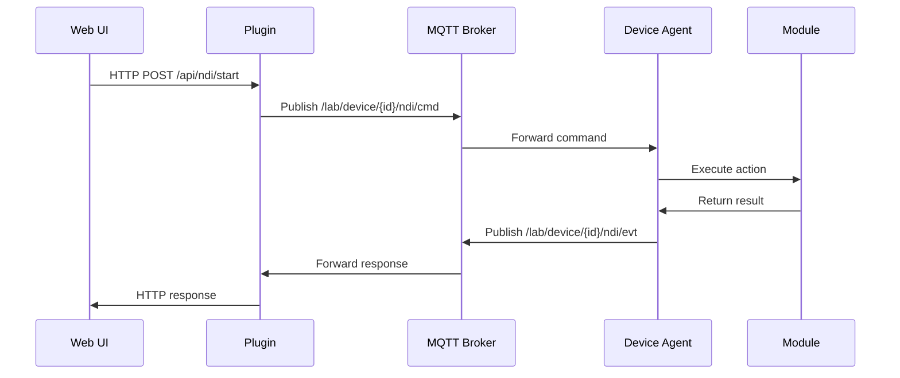

# Lab Platform Features

Features are the pluggable components that extend the Lab Platform with device-specific functionality. Each feature consists of a paired **Module** (device-side) and **Plugin** (orchestrator-side) that work together to provide complete functionality.

## 🏗️ Architecture

```
features/
├── modules/                    # Device-side components
│   ├── ndi/                   # NDI video streaming
│   │   ├── manifest.yaml      # Module metadata
│   │   ├── ndi_module.py      # Module implementation
│   │   └── check_readiness.py # Readiness validation
│   └── projector/             # Projector control
│       ├── manifest.yaml
│       ├── projector_module.py
│       └── check_readiness.py
├── plugins/                   # Orchestrator-side components
│   ├── ndi/                   # NDI orchestration
│   │   ├── manifest.yaml      # Plugin metadata
│   │   ├── ndi_plugin.py      # Plugin implementation
│   │   └── check_readiness.py # Readiness validation
│   └── projector/             # Projector orchestration
│       ├── manifest.yaml
│       ├── projector_plugin.py
│       └── check_readiness.py
└── README.md                  # This file
```

## 🔧 Current Features

### NDI (Network Device Interface)
**Purpose**: Video streaming and recording control

**Module Capabilities**:
- Start/stop NDI viewers and recorders
- Dynamic source switching
- Process management for NDI tools
- Environment configuration (NDI_PATH, etc.)

**Plugin Capabilities**:
- Web UI for device management
- REST API for programmatic control
- Device reservation system
- NDI source discovery
- Real-time status monitoring

**Supported Actions**:
- `start` - Start NDI viewer with source
- `stop` - Stop NDI viewer
- `restart` - Restart with new configuration
- `set_input` - Change input source
- `record_start` - Begin recording stream
- `record_stop` - End recording
- `list_processes` - Show running NDI processes

### Projector Control
**Purpose**: Serial-based projector management

**Module Capabilities**:
- RS232/USB serial communication
- Power control (on/off)
- Input selection (HDMI1/HDMI2)
- Navigation commands
- Image adjustments (keystone, shift)

**Plugin Capabilities**:
- Web interface for projector control
- REST API for automation
- Device status monitoring
- Command validation and feedback

**Supported Actions**:
- `power` - Control power state
- `input` - Select input source
- `command` - Send raw commands
- `navigate` - Navigation controls
- `adjust` - Image adjustments
- `status` - Get current status

## 🚀 Quick Start

### Using Existing Features

1. **Start Infrastructure**:
   ```bash
   cd lab_platform
   make start
   ```

2. **Configure Device Agent**:
   ```bash
   cd device-agent
   # Edit .env to include feature labels
   DEVICE_LABELS=ndi,projector
   make run
   ```

3. **Access Web UI**:
   ```bash
   open http://localhost:8000/ui/ndi
   open http://localhost:8000/ui/projector
   ```

### Creating New Features

1. **Plan Your Feature**:
   - Identify hardware/software to control
   - Define required actions and parameters
   - Plan user interface requirements

2. **Create Module** (device-side):
   ```bash
   mkdir -p features/modules/my_feature
   cd features/modules/my_feature
   
   # Create manifest, implementation, and readiness check
   ```

3. **Create Plugin** (orchestrator-side):
   ```bash
   mkdir -p features/plugins/my_feature
   cd features/plugins/my_feature
   
   # Create manifest, implementation, and readiness check
   ```

## 📝 Module Development

### Module Structure

```python
from lab_agent.base import Module
from typing import Dict, Any

class MyModule(Module):
    """My custom module implementation."""
    
    name = "my_module"
    
    def __init__(self, device_id: str, cfg: Dict[str, Any] = None):
        super().__init__(device_id, cfg)
        # Initialize your module
    
    def handle_cmd(self, action: str, params: Dict[str, Any]) -> tuple[bool, str | None, dict]:
        """Handle module commands."""
        if action == "start":
            return self._handle_start(params)
        elif action == "stop":
            return self._handle_stop()
        elif action == "status":
            return self._handle_status()
        else:
            return False, f"Unknown action: {action}", {}
    
    def _handle_start(self, params: Dict[str, Any]) -> tuple[bool, None, dict]:
        # Implementation here
        return True, None, {"status": "started"}
    
    def _handle_stop(self) -> tuple[bool, None, dict]:
        # Implementation here
        return True, None, {"status": "stopped"}
    
    def _handle_status(self) -> tuple[bool, None, dict]:
        # Return current status
        return True, None, {"running": True}
    
    def shutdown(self) -> None:
        """Clean up resources."""
        pass
```

### Module Manifest

```yaml
# manifest.yaml
name: my_module
version: 1.0.0
description: "Description of my module"
module_file: my_module.py
class_name: MyModule

# Configuration schema
config_schema:
  port:
    type: integer
    description: "Port number"
    required: true
  timeout:
    type: number
    description: "Timeout in seconds"
    default: 5.0

# Default configuration
default_config:
  port: 8080
  timeout: 5.0

# Supported actions
actions:
  - name: start
    description: "Start the module"
    params:
      mode:
        type: string
        required: false
  - name: stop
    description: "Stop the module"
  - name: status
    description: "Get module status"
```

## 🔌 Plugin Development

### Plugin Structure

```python
from lab_orchestrator.plugin_api import OrchestratorPlugin
from fastapi import APIRouter
from typing import Dict, Any, List, Optional

class MyPlugin(OrchestratorPlugin):
    """My custom plugin implementation."""
    
    module_name = "my_module"
    
    def mqtt_topic_filters(self) -> List[str]:
        """Return MQTT topics this plugin handles."""
        return [f"/lab/orchestrator/{self.module_name}/cmd"]
    
    def handle_mqtt(self, topic: str, payload: Dict[str, Any]) -> None:
        """Handle incoming MQTT messages."""
        req_id = payload.get("req_id", "no-req")
        action = payload.get("action")
        params = payload.get("params", {})
        device_id = params.get("device_id")
        
        try:
            if action in ["start", "stop", "status"]:
                # Forward to device
                self._forward_to_device(device_id, payload)
            else:
                self._send_error(req_id, f"Unknown action: {action}")
        except Exception as e:
            self._send_error(req_id, str(e))
    
    def api_router(self) -> Optional[APIRouter]:
        """Create API router for HTTP endpoints."""
        router = APIRouter()
        
        @router.get("/status")
        def get_status():
            return {"plugin": self.module_name, "devices": self._get_devices()}
        
        @router.post("/start")
        def start_device(device_id: str, params: dict = {}):
            # Send command to device
            payload = {
                "req_id": f"api-{int(time.time() * 1000)}",
                "actor": "api",
                "action": "start",
                "params": {"device_id": device_id, **params}
            }
            self._forward_to_device(device_id, payload)
            return {"status": "dispatched"}
        
        return router
    
    def ui_mount(self) -> Optional[Dict[str, str]]:
        """Return UI mount configuration."""
        return {
            "path": "/ui/my_module",
            "title": "My Module",
            "template": "my_module.html"
        }
```

### Plugin Manifest

```yaml
# manifest.yaml
name: my_plugin
version: 1.0.0
description: "Description of my plugin"
plugin_class: my_plugin:MyPlugin

# API endpoints
api_endpoints:
  - path: "/status"
    method: "GET"
    description: "Get plugin status"
  - path: "/start"
    method: "POST"
    description: "Start device"

# UI configuration
ui:
  path: "/ui/my_module"
  template: "my_module.html"
  title: "My Module"

# MQTT topics handled
mqtt_topics:
  - "/lab/orchestrator/my_module/cmd"

# Supported actions
actions:
  - name: start
    description: "Start device"
  - name: stop
    description: "Stop device"
  - name: status
    description: "Get status"
```

## 🔍 Feature Communication

### MQTT Message Flow



### Message Format

**Command Message**:
```json
{
  "req_id": "550e8400-e29b-41d4-a716-446655440000",
  "actor": "api",
  "ts": "2024-01-01T12:00:00Z",
  "action": "start",
  "params": {
    "device_id": "ndi-01",
    "source": "Camera 1"
  }
}
```

**Response Message**:
```json
{
  "req_id": "550e8400-e29b-41d4-a716-446655440000",
  "success": true,
  "error": null,
  "data": {
    "status": "started",
    "pid": 1234
  },
  "ts": "2024-01-01T12:00:01Z"
}
```

## 🔧 Configuration

### Module Configuration

Modules can be configured in the device agent's `config.yaml`:

```yaml
modules:
  ndi:
    ndi_path: "/usr/local/lib/ndi"
    log_file: "/tmp/ndi_device.log"
    start_cmd_template: "ndi-viewer {source}"
  
  projector:
    serial_port: "/dev/ttyUSB0"
    baudrate: 9600
    timeout: 1.0
```

### Plugin Configuration

Plugins receive configuration through their manifest and runtime settings:

```yaml
# In plugin manifest
settings:
  discovery_timeout: 3.0
  max_devices: 10
  cache_duration: 300
```

## 🧪 Testing Features

### Module Testing

```bash
# Test module loading
cd device-agent
python3 -c "
from lab_agent.agent import DeviceAgent
agent = DeviceAgent({'device_id': 'test'})
print('Available modules:', list(agent.modules.keys()))
"

# Test module commands
python3 -c "
from features.modules.ndi.ndi_module import NDIModule
module = NDIModule('test-device')
result = module.handle_cmd('status', {})
print('Result:', result)
"
```

### Plugin Testing

```bash
# Test plugin loading
cd infra/orchestrator
python3 -c "
from lab_orchestrator.host import _load_feature_plugins
_load_feature_plugins()
print('Plugins loaded successfully')
"

# Test API endpoints
curl http://localhost:8000/api/ndi/status
curl -X POST http://localhost:8000/api/ndi/start \
  -H "Content-Type: application/json" \
  -d '{"device_id": "ndi-01", "params": {"source": "test"}}'
```

### Integration Testing

```bash
# Full system test
make start                    # Start infrastructure
cd device-agent && make run  # Start device agent
curl http://localhost:8000/api/registry  # Check device registration
```

## 📋 Readiness Checks

Each feature includes readiness validation:

```bash
# Check module readiness
cd features/modules/ndi
python3 check_readiness.py --verbose

# Check plugin readiness
cd features/plugins/ndi
python3 check_readiness.py --verbose

# Check all features
make check-readiness
```

## 🔧 Best Practices

### Module Development
- **Error Handling**: Always return structured error responses
- **Resource Cleanup**: Implement proper `shutdown()` method
- **Configuration**: Use manifest-defined configuration schema
- **Logging**: Use structured logging with device context
- **Process Management**: Handle external processes safely

### Plugin Development
- **Input Validation**: Validate all API inputs with Pydantic models
- **Error Propagation**: Forward errors from modules to users
- **Resource Locking**: Use registry for device reservations
- **UI Consistency**: Follow Bootstrap design patterns
- **API Documentation**: Document all endpoints clearly

### Security
- **Input Sanitization**: Validate all user inputs
- **Command Injection**: Avoid shell injection in modules
- **Access Control**: Implement proper authorization
- **Network Security**: Use TLS in production
- **Audit Logging**: Log all significant actions

## 🐛 Troubleshooting

### Module Issues

```bash
# Check module manifest
python3 -c "import yaml; print(yaml.safe_load(open('manifest.yaml')))"

# Test module import
python3 -c "from my_module import MyModule; print('OK')"

# Check device agent logs
tail -f /tmp/lab_agent_*.log
```

### Plugin Issues

```bash
# Check plugin manifest
python3 -c "import yaml; print(yaml.safe_load(open('manifest.yaml')))"

# Test plugin import
python3 -c "from my_plugin import MyPlugin; print('OK')"

# Check orchestrator logs
docker logs lab-orchestrator
```

### Communication Issues

```bash
# Monitor MQTT traffic
mosquitto_sub -h localhost -t '/lab/+/+' -v

# Test MQTT connectivity
mosquitto_pub -h localhost -t test -m "hello"

# Check network connectivity
ping mqtt-broker
telnet mqtt-broker 1883
```

## 📚 Examples

### Simple LED Control Module

```python
import RPi.GPIO as GPIO
from lab_agent.base import Module

class LEDModule(Module):
    name = "led"
    
    def __init__(self, device_id: str, cfg: dict = None):
        super().__init__(device_id, cfg)
        self.pin = cfg.get("pin", 18)
        GPIO.setmode(GPIO.BCM)
        GPIO.setup(self.pin, GPIO.OUT)
        self.state = False
    
    def handle_cmd(self, action: str, params: dict) -> tuple[bool, str | None, dict]:
        if action == "on":
            GPIO.output(self.pin, GPIO.HIGH)
            self.state = True
            return True, None, {"state": "on"}
        elif action == "off":
            GPIO.output(self.pin, GPIO.LOW)
            self.state = False
            return True, None, {"state": "off"}
        elif action == "status":
            return True, None, {"state": "on" if self.state else "off"}
        else:
            return False, f"Unknown action: {action}", {}
    
    def shutdown(self):
        GPIO.cleanup()
```

### HTTP Service Module

```python
import requests
from lab_agent.base import Module

class HTTPModule(Module):
    name = "http_service"
    
    def __init__(self, device_id: str, cfg: dict = None):
        super().__init__(device_id, cfg)
        self.base_url = cfg.get("base_url", "http://localhost:8080")
    
    def handle_cmd(self, action: str, params: dict) -> tuple[bool, str | None, dict]:
        if action == "get":
            path = params.get("path", "/")
            try:
                response = requests.get(f"{self.base_url}{path}")
                return True, None, {
                    "status_code": response.status_code,
                    "data": response.json() if response.headers.get("content-type", "").startswith("application/json") else response.text
                }
            except Exception as e:
                return False, str(e), {}
        elif action == "post":
            path = params.get("path", "/")
            data = params.get("data", {})
            try:
                response = requests.post(f"{self.base_url}{path}", json=data)
                return True, None, {
                    "status_code": response.status_code,
                    "data": response.json() if response.headers.get("content-type", "").startswith("application/json") else response.text
                }
            except Exception as e:
                return False, str(e), {}
        else:
            return False, f"Unknown action: {action}", {}
```

## 📄 License

[Your License Here]

## 🆘 Support

- **Main Documentation**: See repository root documentation
- **Issues**: Report feature-specific bugs on GitHub
- **Examples**: Check existing NDI and Projector implementations
- **Community**: Join discussions for feature development